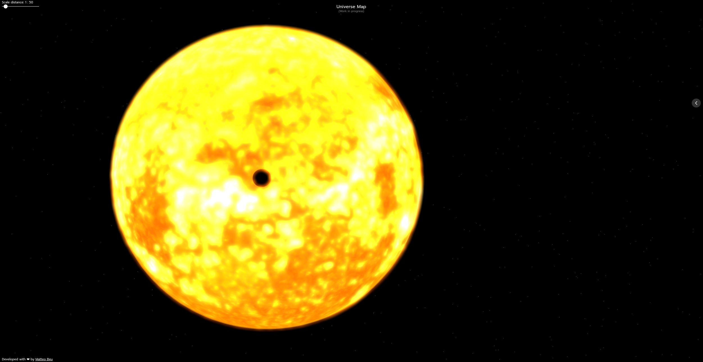

# 🌌 Universe Map

**Universe Map** is an interactive 3D project that aims to visualize the known universe — starting from our Solar System.



## 🚀 About the Project

Universe Map is a long-term personal project focused on building a realistic, explorable 3D map of space using real astronomical data.

Currently, it features a detailed and animated model of the **Solar System**, including accurate scales, axial tilts, and textures.

🔭 In future updates, the project will include **all nearby stars**, based on actual scientific data.

> I work on this project whenever I find the time — it's a labor of love, driven by my fascination with space and 3D visualization.

---

## 🌐 Live Demo

You can explore the project live at:  
🔭 **[universe.matteobeu.com](https://universe.matteobeu.com)**

---

## 🧪 Tech Stack

- **[Three.js](https://threejs.org/)** – WebGL 3D rendering
- **[React](https://reactjs.org/)** – Frontend architecture
- **[TypeScript](https://www.typescriptlang.org/)** – Type safety and scalability
- **[Vite](https://vitejs.dev/)** – Lightning-fast development tooling

---

## 💻 Running Locally

```bash
git clone https://github.com/your-username/universe_map.git
cd universe_map
npm install
npm run dev
```

Then open http://localhost:5173 in your browser.

---

## 👤 Author

Created with passion by **Matteo Beu**  
🔗 [matteobeu.com](https://matteobeu.com)
