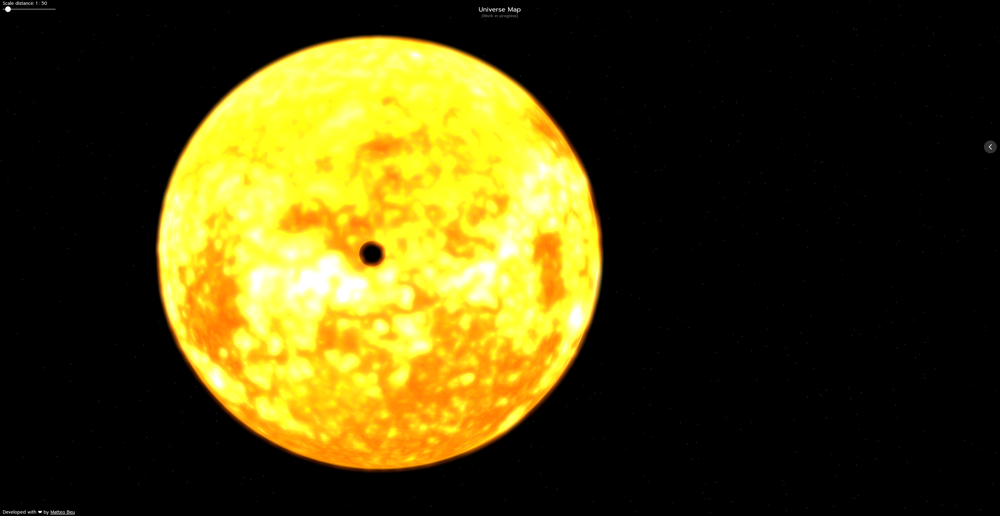

# Universe Map

An interactive 3D visualization of our Solar System and the Milky Way galaxy, with real scale distances and proportions. Built to offer an educational and illustrative experience of the cosmos we live in.



**[universe.matteobeu.com](https://universe.matteobeu.com)**

## Features

- **Solar System** — All 8 planets with 18 major moons, accurate positions from NASA JPL Horizons
- **Milky Way** — 150,000 star point cloud with procedural spiral arm structure
- **Real Scale Mode** — Toggle between compressed (logarithmic) and true-to-life distances
- **Live Mission Tracking** — Real-time spacecraft tracking with telemetry, 3D models, and mission HUD (currently featuring NASA's Artemis II)
- **Orbit Trajectories** — Rendered from actual ephemeris data
- **Planet Details** — Explore panel with stats, atmosphere composition, and navigation through the celestial hierarchy
- **Accurate Rotation** — Axial tilts from IAU pole coordinates, real-time spin rates, Earth ERA formula
- **Day/Night Cycle** — Earth with day map, night lights, and cloud layer

## Tech Stack

- **React 19** + **TypeScript** + **Vite**
- **Three.js** via React Three Fiber + Drei
- **Tailwind CSS v4**
- **NASA JPL Horizons** — Ephemeris and trajectory data

Client-side only, no backend.

## Running Locally

```bash
git clone https://github.com/matteo4884/universe-map.git
cd universe-map
npm install
npm run dev
```

Open http://localhost:5317

### Updating Data

```bash
node scripts/fetch-ephemeris.mjs    # Planet positions and orbits
node scripts/fetch-artemis.mjs      # Artemis II live tracking data
```

## Author

Created by **[Matteo Beu](https://matteobeu.com)**

Data: NASA JPL Horizons | Engine: Three.js + React Three Fiber
