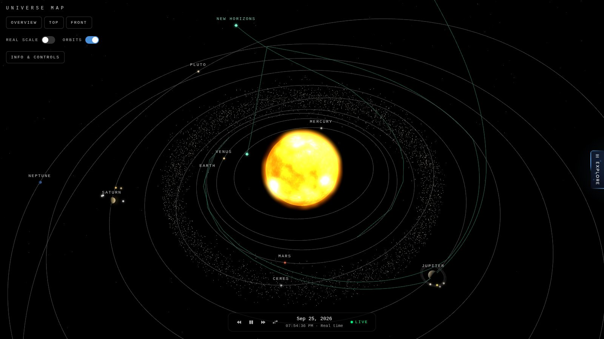

# Universe Map

An interactive 3D visualization of our Solar System and the Milky Way galaxy, with real scale distances and proportions. Built to offer an educational and illustrative experience of the cosmos we live in.



**[universe.matteobeu.com](https://universe.matteobeu.com)**

## Features

- **Live Solar System** — The Sun, 8 planets, 19 moons, Ceres and Pluto, placed where they are right now from NASA JPL Horizons orbital data
- **Time travel** — Play time forward or backward up to a year per second, or jump to any date between 1800 and 2200
- **Spacecraft** — Voyager 1 and 2, New Horizons and the James Webb Space Telescope, with the path each has flown
- **Asteroid belt** — Thousands of asteroids circling between Mars and Jupiter at their own speed
- **Milky Way** — 150,000 star point cloud with a central bar and spiral arms
- **Filters** — Show or hide orbits, spacecraft, the asteroid belt and labels; orbits fade away in close-ups
- **Real Scale Mode** — Toggle between compressed (logarithmic) and true-to-life distances, with a scale bar
- **Explore panel** — Stats, atmosphere and live facts for every body: distance from Earth, light travel time, Moon phase
- **Shareable links** — `?body=saturn` opens straight on Saturn; the back button walks through previous selections
- **Accurate rotation** — Axial tilts from IAU pole coordinates, spin rates, Earth rotation angle
- **Day/Night Cycle** — Earth with day map, night lights, and cloud layer
- **Mission Mode** — Real-time tracking with telemetry, 3D model and mission HUD while a configured mission is in flight (first used live for NASA's Artemis II, April 2026)

### Controls

| Input | Action |
|---|---|
| Click / double-click | Select a body / fly to it |
| `0`–`9` | Sun, planets, Pluto |
| `O` `T` `F` | Overview, top, front view |
| `R` / `L` | Real scale / orbit lines |
| `Space`, `[` `]`, `N` | Play/pause, slower/faster, back to now |
| `Esc` | Close the panel |

## Tech Stack

- **React 19** + **TypeScript** + **Vite**
- **Three.js** via React Three Fiber + Drei
- **Tailwind CSS v4**
- **NASA JPL Horizons** — Orbital elements and spacecraft trajectories
- **Vitest** + **Playwright** — Unit tests and smoke tests, run by GitHub Actions

Client-side only: a static site plus a JSON file refreshed daily by a cron job.

## Running Locally

```bash
git clone https://github.com/matteo4884/universe-map.git
cd universe-map
npm install
npm run dev
```

Open http://localhost:5317

```bash
npm test            # unit tests (orbital model vs JPL Horizons, scale rules)
npm run build
npm run test:e2e    # smoke tests on the production build
```

### Updating Data

```bash
node scripts/fetch-ephemeris.mjs     # Orbital elements + spacecraft paths → orbits.json
node scripts/fetch-test-fixture.mjs  # Horizons reference vectors for the tests
node scripts/fetch-artemis.mjs       # Mission mode live tracking data
```

## Author

Created by **[Matteo Beu](https://matteobeu.com)**

Data: NASA JPL Horizons | Engine: Three.js + React Three Fiber
